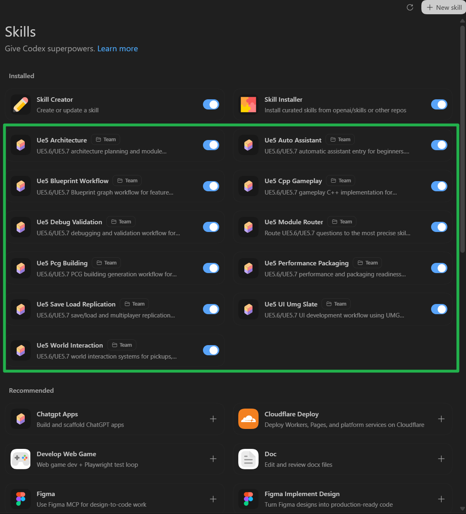
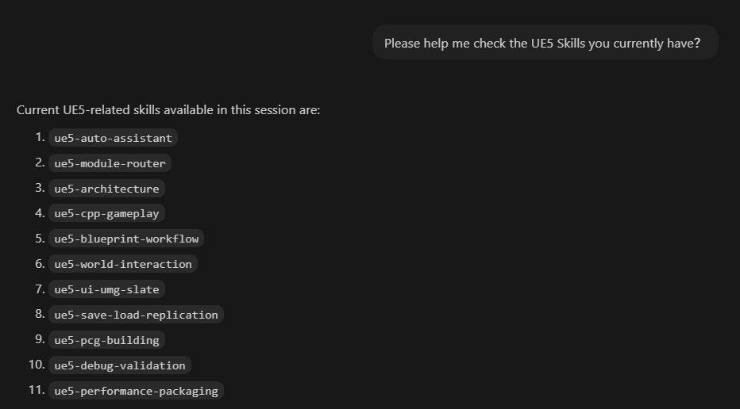
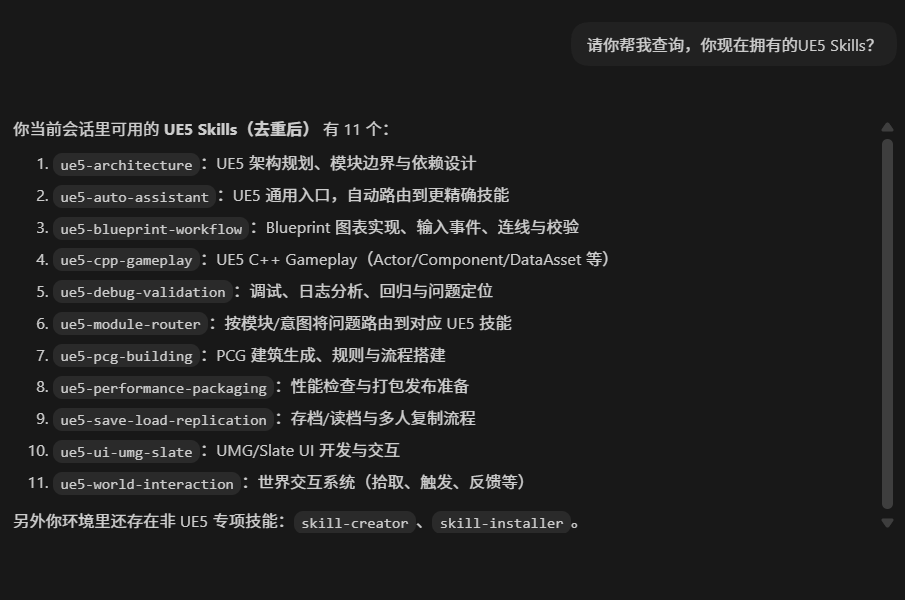

# UnrealEngine5-Skills

[English](#english) | [中文](#中文)

## English

A practical Codex skill pack for Unreal Engine **5.6-5.8** projects.

This repository provides reusable skill workflows to help with:

- Blueprint feature implementation
- Gameplay C++ development
- UI (UMG/Slate) tasks
- Save/Load and replication
- PCG procedural building generation
- Debugging and validation
- Performance and packaging checks
- Architecture and module-boundary design

### Skills Overview Screenshot



> Screenshot of the Codex Skills panel showing the installed UE5 skill set and enabled status (captured on March 3, 2026).



> Screenshot of the UE5 skills list for AI Q&A (English version, captured on March 3, 2026).

### Latest Update (August 2026)

The skill pack now supports UE5.6 through UE5.8. The UE5.8 pass was validated against an installed UE5.8.2 engine source tree while preserving the existing UE5.6/UE5.7 workflows.

Compatibility-covered skills:

- `ue5-auto-assistant`
- `ue5-module-router`
- `ue5-architecture`
- `ue5-pcg-building`
- `ue5-blueprint-workflow`
- `ue5-cpp-gameplay`
- `ue5-save-load-replication`
- `ue5-world-interaction`
- `ue5-ui-umg-slate`
- `ue5-performance-packaging`
- `ue5-debug-validation`

What changed in this pass:

- Expanded API anchors and compatibility notes to UE5.6-UE5.8
- Updated UE5.8 PCG scheduler guidance to use execution-source APIs instead of deprecated component refresh calls
- Added UE5.8-specific packaging, Incremental Cooking, Enhanced Input debugging, Iris, and PCG capability notes
- Rebuilt the module index and routing table from UE5.8.2 engine source
- Passed source-anchor validation on UE5.7.4 and UE5.8.2 while preserving the established UE5.6 compatibility path
- Fixed skill validation on Windows CRLF checkouts
- Added stage-contract sections to make workflows decision-complete
- Converted failure handling into executable `symptom -> locate -> fix` checklists

### Skill List

- `ue5-auto-assistant`: default entry and intent-based routing
- `ue5-module-router`: module name/alias based routing
- `ue5-architecture`: module layout, Build.cs, ownership boundaries
- `ue5-blueprint-workflow`: Blueprint graph edits and input-event workflows
- `ue5-cpp-gameplay`: gameplay C++ patterns for UE5.6-5.8
- `ue5-debug-validation`: issue triage and validation workflow
- `ue5-performance-packaging`: runtime perf and pre-package checks
- `ue5-save-load-replication`: SaveGame and multiplayer sync workflow
- `ue5-ui-umg-slate`: UMG/Slate implementation guidance
- `ue5-world-interaction`: pickups, spawners, overlap/trace interaction logic
- `ue5-pcg-building`: PCG building generation, shape grammar, and runtime generation validation

### Quick Start

1. Start with `ue5-auto-assistant`.
2. If module names appear, route with `ue5-module-router`.
3. Execute the selected target skill workflow.

More details are in [skills/README.md](./skills/README.md).

### Validation

Run:

```powershell
python .\skills\scripts\validate_skills.py
python .\skills\scripts\validate_engine_anchors.py --engine-root "E:\UEVersion\UE_5.8"
```

Expected output: `Validation OK` and `Engine anchor validation OK`

### Risk Notice (Testing Stage)

This skill pack is currently in testing and iterative improvement stage.
Use with caution in production projects.

- Always back up your project before applying generated changes.
- Validate in a sandbox/test branch first, then merge into production.
- Review generated Blueprint/C++ changes before final integration.
- Community contributions are welcome to improve prompts, workflows, and references.

### License

This project is licensed under the MIT License. See [LICENSE](./LICENSE).

## 中文

这是一个面向 Unreal Engine **5.6-5.8** 的 Codex 技能包。

仓库提供可复用的技能工作流，覆盖：

- Blueprint 功能实现
- Gameplay C++ 开发
- UI（UMG/Slate）开发
- 存档/读档与多人同步
- PCG 程序化建筑生成
- 调试与验证
- 性能与打包检查
- 架构与模块边界设计

### Skills 总览截图


> 该图为 Codex Skills 面板截图，展示当前已安装的 UE5 技能集合及启用状态（截图时间：2026年3月3日）。



> 该图为 UE5 技能列表（AI问答）中文截图（截图时间：2026年3月3日）。

### 最新更新（2026年8月）

技能包现已支持 UE5.6 到 UE5.8。本轮使用已安装的 UE5.8.2 引擎源码完成验证，同时保留原有 UE5.6/UE5.7 工作流。

已覆盖兼容性的技能：

- `ue5-auto-assistant`
- `ue5-module-router`
- `ue5-architecture`
- `ue5-pcg-building`
- `ue5-blueprint-workflow`
- `ue5-cpp-gameplay`
- `ue5-save-load-replication`
- `ue5-world-interaction`
- `ue5-ui-umg-slate`
- `ue5-performance-packaging`
- `ue5-debug-validation`

本轮更新包括：

- API 锚点和兼容说明扩展至 UE5.6-UE5.8
- UE5.8 PCG 调度改用 Execution Source API，避免继续推荐已弃用的 Component Refresh API
- 增加 UE5.8 打包、Incremental Cooking、Enhanced Input 调试、Iris 和 PCG 新能力说明
- 使用 UE5.8.2 引擎源码重建模块索引和路由表
- UE5.7.4 与 UE5.8.2 源码锚点校验通过，并保留既有 UE5.6 兼容路径
- 修复 Windows CRLF 检出环境中的 Skill 校验问题
- 阶段契约（保证流程可执行、可交付）
- 可执行故障处理（症状 -> 定位 -> 修复）

### 技能列表

- `ue5-auto-assistant`：默认入口，按意图自动路由
- `ue5-module-router`：按模块名/别名进行路由
- `ue5-architecture`：模块划分、Build.cs 依赖、职责边界设计
- `ue5-blueprint-workflow`：Blueprint 图表编辑与输入事件工作流
- `ue5-cpp-gameplay`：UE5.6-5.8 Gameplay C++ 实现模式
- `ue5-debug-validation`：问题排查与验证工作流
- `ue5-performance-packaging`：运行时性能与打包前检查
- `ue5-save-load-replication`：SaveGame 与多人同步工作流
- `ue5-ui-umg-slate`：UMG/Slate UI 开发指导
- `ue5-world-interaction`：拾取、生成器、Overlap/Trace 交互逻辑
- `ue5-pcg-building`：PCG 建筑生成、Shape Grammar 与运行时生成验证

### 快速开始

1. 先从 `ue5-auto-assistant` 开始。
2. 如果请求里出现模块名，使用 `ue5-module-router` 做精确路由。
3. 按路由结果执行目标技能工作流。

更多细节见 [skills/README.md](./skills/README.md)。

### 校验

运行：

```powershell
python .\skills\scripts\validate_skills.py
python .\skills\scripts\validate_engine_anchors.py --engine-root "E:\UEVersion\UE_5.8"
```

期望输出：`Validation OK` 和 `Engine anchor validation OK`

### 风险提示（测试阶段）

当前技能包处于测试与持续迭代阶段，请谨慎在正式项目中使用。

- 使用前请先做好项目备份。
- 建议先在测试分支/沙盒环境验证，再合入正式分支。
- 对自动生成的 Blueprint/C++ 改动进行人工复核后再集成。
- 欢迎大家共同构建和完善本技能包（话术、工作流、参考资料）。

### 许可证

本项目采用 MIT License，详见 [LICENSE](./LICENSE)。
